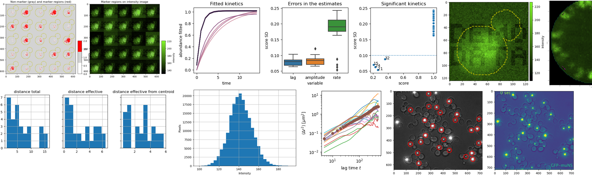

<!-- PROJECT SHIELDS -->
<div align="center">
  
<!-- [![Contributors][contributors-shield]][contributors-url]
[![Forks][forks-shield]][forks-url]
[![Stargazers][stars-shield]][stars-url] -->
<a href="">[](https://pypi.org/project/htsimaging)</a>
<a href="">[](https://github.com/rraadd88/htsimaging/actions/workflows/build.yml)</a>
<a href="">[](https://github.com/rraadd88/htsimaging/issues)</a>
<br />
<a href="">[](https://pepy.tech/project/htsimaging)</a>
<a href="">[](https://github.com/rraadd88/htsimaging/blob/main/LICENSE)</a>
</div>
  
<!-- PROJECT LOGO -->
<div align="center">
  
  <h1 align="center">htsimaging</h1>
  <p align="center">
    High-Throughput Single-cell Imaging analysis.
    <br />
    <a href="https://github.com/rraadd88/htsimaging#examples">Examples</a>
    ·
    <a href="https://github.com/rraadd88/htsimaging#api">Explore the API</a>
  </p>
</div>  

   

# Examples  

[📈 Single-cell protein abundance and its normalization](https://github.com/rraadd88/htsimaging/blob/main/examples/protein_abundance_and_normalization.ipynb)   
[📈 Single-cell protein abundance by marker localization](https://github.com/rraadd88/htsimaging/blob/main/examples/protein_abundance_by_marker_location.ipynb)  
[🖼️ Visualization of the images.](https://github.com/rraadd88/htsimaging/blob/main/examples/viz_image.ipynb)  
[📈 Quantitative analysis of endocytosis.](https://github.com/rraadd88/htsimaging/blob/main/examples/endocytosis.ipynb)  
[📈 Single-particle tracking (SPT).](https://github.com/rraadd88/htsimaging/blob/main/examples/spt.ipynb)  
[📈 Calculating the recovery rate from a bleach-chase data](https://github.com/rraadd88/htsimaging/blob/main/examples/bleach_chase.ipynb)  

# Installation
    
```
pip install htsimaging              # with basic dependencies  
```
With additional dependencies as required:
```
pip install htsimaging[spt]         # for the analysis of the Single-Particle Tracking e.g. endocytosis.
```
  
# How to cite?  
1. Using BibTeX:   
```
@software{Dandage_htsimaging,
  title   = {htsimaging: High-Throughput Single-cell Imaging analysis in python},
  author  = {Dandage, Rohan},
  year    = {2023},
  url     = {https://zenodo.org/doi/10.5281/zenodo.3697134},
  version = {v1.0.5},
  note    = {The URL is a DOI link to the permanent archive of the software.},
}
```
2. DOI link: [](https://zenodo.org/doi/10.5281/zenodo.3697134), or  

3. Using citation information from [CITATION.CFF file](https://github.com/rraadd88/htsimaging/blob/main/CITATION.cff).  
  

# Future directions, for which contributions are welcome  
- [ ] Command-line usage.  
  
# Similar projects  
- https://github.com/vanvalenlab/deepcell-tf  
- https://github.com/junlabucsd/napari-mm3  

# API
<!-- markdownlint-disable -->

<a href="https://github.com/rraadd88/htsimaging/blob/master/htsimaging/bleach_chase"></a>

## <kbd>module</kbd> `htsimaging.bleach_chase`


<!-- markdownlint-disable -->

<a href="https://github.com/rraadd88/htsimaging/blob/master/htsimaging/bleach_chase.py#L0"></a>

## <kbd>module</kbd> `htsimaging.bleach_chase.stat`
Statistical analysis of the bleach-chase 


---

<a href="https://github.com/rraadd88/htsimaging/blob/master/htsimaging/bleach_chase/stat.py#L5"></a>

### <kbd>function</kbd> `exp1`

```python
exp1(x, lag, amplitude, rate)
```

One-term exponential. 


**Parameters:**
 
 - <b>`x`</b> (list):  input vector 
 - <b>`lag`</b> (float):  lag    
 - <b>`amplitude`</b> (float):  amplitude 
 - <b>`rate`</b> (float):  rate 


---

<a href="https://github.com/rraadd88/htsimaging/blob/master/htsimaging/bleach_chase/stat.py#L16"></a>

### <kbd>function</kbd> `get_scores`

```python
get_scores(df: DataFrame) → DataFrame
```

Calculate the rates other parameters. 


**Parameters:**
 
 - <b>`df`</b> (pd.DataFrame):  input table. 


**Returns:**
 
 - <b>`pd.DataFrame`</b>:  table with the parameters. 


<!-- markdownlint-disable -->

<a href="https://github.com/rraadd88/htsimaging/blob/master/htsimaging/endocytosis.py#L0"></a>

## <kbd>module</kbd> `htsimaging.endocytosis.io`
Processing of the paths of input images to create configurations and metadata. 


---

<a href="https://github.com/rraadd88/htsimaging/blob/master/htsimaging/endocytosis/io.py#L12"></a>

### <kbd>function</kbd> `make_project_cfg`

```python
make_project_cfg(
    prjd: str,
    output_dir_path: str,
    bright_fn_marker: str = None,
    segmented_fn_marker: str = None,
    magnification: int = None,
    image_ext: str = 'tif',
    cores: int = 1,
    test: bool = False,
    force: bool = False
) → dict
```

Make the confguration for the analysis run. 


**Args:**
 
 - <b>`prjd`</b> (str):  path to the directory with the images. 
 - <b>`output_dir_path`</b> (str):  output directory path. 
 - <b>`bright_fn_marker`</b> (_type_):  marker in the path of the bright field images. 
 - <b>`segmented_fn_marker`</b> (_type_):  marker in the path of the segmented images. 
 - <b>`cores`</b> (int, optional):  number of cores. Defaults to 1. 
 - <b>`test`</b> (bool, optional):  test-mode. Defaults to False. 
 - <b>`force`</b> (bool, optional):  over-write theoutputs. Defaults to False. 


**Returns:**
 
 - <b>`dict`</b>:  metadata 


**Notes:**

> Infer the magnification from the filenames: if 'T1C1' in cfg['bright_fn_marker']: cfg['magnification']=150 elif cfg['bright_fn_marker']=='_t': cfg['magnification']=100 


---

<a href="https://github.com/rraadd88/htsimaging/blob/master/htsimaging/endocytosis/io.py#L101"></a>

### <kbd>function</kbd> `make_cell_cfg`

```python
make_cell_cfg(
    cfg: dict,
    frames: list,
    cells: list,
    trial: str,
    celli: int,
    cellbox: list,
    params_get_signal_summary_by_roi: dict = {'xy_center': None, 'width': 20, 'fun_summary_frame': 'min', 'fun_summary_frames': 'median'},
    filterby_centroid: bool = False,
    scale_signal_cytoplasm: float = 1.5,
    test: bool = False,
    force: bool = False
) → dict
```

Make the configuration for an individual cell. 


**Args:**
 
 - <b>`cfg`</b> (dict):  metadata. 
 - <b>`frames`</b> (list):  list of frames. 
 - <b>`cells`</b> (list):  list of cells. 
 - <b>`trial`</b> (str):  trial name. 
 - <b>`celli`</b> (int):  index of the cell. 
 - <b>`cellbox`</b> (list):  bounding box of the cell 
 - <b>`params_get_signal_summary_by_roi`</b> (dict, optional):  parameters for the aggregation of the values at the ROI. Defaults to {'xy_center':None,'width':20, 'fun_summary_frame':'min', 'fun_summary_frames':'median' }. 
 - <b>`test`</b> (bool, optional):  test-mode. Defaults to False. 
 - <b>`force`</b> (bool, optional):  over-write the output. Defaults to False. 


**Returns:**
 
 - <b>`dict`</b>:  metadata 


<!-- markdownlint-disable -->

<a href="https://github.com/rraadd88/htsimaging/blob/master/htsimaging/endocytosis"></a>

## <kbd>module</kbd> `htsimaging.endocytosis`


<!-- markdownlint-disable -->

<a href="https://github.com/rraadd88/htsimaging/blob/master/htsimaging/endocytosis.py#L0"></a>

## <kbd>module</kbd> `htsimaging.endocytosis.vid`
To make the video of the timelapse images. 


---

<a href="https://github.com/rraadd88/htsimaging/blob/master/htsimaging/endocytosis/vid.py#L9"></a>

### <kbd>function</kbd> `make_gif`

```python
make_gif(
    cellcfg=None,
    frames: list = None,
    t_cor: DataFrame = None,
    img_bright=None,
    outd: str = None,
    particle2color: dict = None,
    test: bool = False,
    force: bool = False
)
```

Make a .gif file out of frames.  


<!-- markdownlint-disable -->

<a href="https://github.com/rraadd88/htsimaging/blob/master/htsimaging/endocytosis.py#L0"></a>

## <kbd>module</kbd> `htsimaging.endocytosis.viz`
Visualizations. 


---

<a href="https://github.com/rraadd88/htsimaging/blob/master/htsimaging/endocytosis/viz.py#L8"></a>

### <kbd>function</kbd> `plot_properties_cell`

```python
plot_properties_cell(cellcfg, df2, cols_colorby, colx='x', coly='y')
```

Plot properties of the cell. 


**Args:**
 
 - <b>`cellcfg`</b> (_type_):  config of a cell. 
 - <b>`df2`</b> (_type_):  input dataframe. 
 - <b>`cols_colorby`</b> (_type_):  columns to color by. 
 - <b>`colx`</b> (str, optional):  column with the x values. Defaults to 'x'. 
 - <b>`coly`</b> (str, optional):  column with the y values. Defaults to 'y'. 


---

<a href="https://github.com/rraadd88/htsimaging/blob/master/htsimaging/endocytosis/viz.py#L52"></a>

### <kbd>function</kbd> `image_locate_particles`

```python
image_locate_particles(
    df1: DataFrame,
    frame,
    img_region,
    annotate_particles: str = False,
    fig=None,
    ax: Axes = None
) → Axes
```

Plot image with particles. 


**Args:**
 
 - <b>`df1`</b> (pd.DataFrame):  input dataframe. 
 - <b>`frame`</b> (_type_):  image frame. 
 - <b>`img_region`</b> (_type_):  regions in the image. 
 - <b>`annotate_particles`</b> (str, optional):  annotate the paticles or not. Defaults to False. 
 - <b>`fig`</b> (_type_, optional):  figure object. Defaults to None. 
 - <b>`ax`</b> (plt.Axes, optional):  subplot object. Defaults to None. 


**Returns:**
 
 - <b>`plt.Axes`</b>:  _description_ 


---

<a href="https://github.com/rraadd88/htsimaging/blob/master/htsimaging/endocytosis/viz.py#L84"></a>

### <kbd>function</kbd> `image_trajectories`

```python
image_trajectories(
    dtraj: DataFrame,
    img_gfp=None,
    img_bright=None,
    label: bool = True,
    fig=None,
    ax: Axes = None
) → Axes
```

Plot trajectories. 


**Args:**
 
 - <b>`dtraj`</b> (pd.DataFrame):  input dataframe with the trajectories. 
 - <b>`img_gfp`</b> (_type_, optional):  channel image e.g. GFP. Defaults to None. 
 - <b>`img_bright`</b> (_type_, optional):  segmentation image e.g. bright field. Defaults to None. 
 - <b>`label`</b> (bool, optional):  label. Defaults to True. 
 - <b>`fig`</b> (_type_, optional):  figure object. Defaults to None. 
 - <b>`ax`</b> (plt.Axes, optional):  subplot object. Defaults to None. 


**Returns:**
 
 - <b>`plt.Axes`</b>:  subplot 


---

<a href="https://github.com/rraadd88/htsimaging/blob/master/htsimaging/endocytosis/viz.py#L124"></a>

### <kbd>function</kbd> `plot_moving_particles`

```python
plot_moving_particles(
    t_cor: DataFrame,
    img_bright=None,
    frame=None,
    framei: int = 0,
    particle2color=None,
    test: bool = False,
    outd: str = None
)
```

Plot moving particles. 


**Args:**
 
 - <b>`t_cor`</b> (pd.DataFrame):  input table 
 - <b>`img_bright`</b> (_type_, optional):  segmentation raw image (e.g. bright field). Defaults to None. 
 - <b>`frame`</b> (_type_, optional):  image frame. Defaults to None. 
 - <b>`framei`</b> (int, optional):  image frame index. Defaults to 0. 
 - <b>`particle2color`</b> (_type_, optional):  particle-wise colors. Defaults to None. 
 - <b>`test`</b> (bool, optional):  test-mode. Defaults to False. 
 - <b>`outd`</b> (str, optional):  path to the output directory. Defaults to None. 


<!-- markdownlint-disable -->

<a href="https://github.com/rraadd88/htsimaging/blob/master/htsimaging/lib.py#L0"></a>

## <kbd>module</kbd> `htsimaging.lib.io`
I/O 


---

<a href="https://github.com/rraadd88/htsimaging/blob/master/htsimaging/lib/io.py#L15"></a>

### <kbd>function</kbd> `read_image`

```python
read_image(imp: str)
```

Read image. 


**Args:**
 
 - <b>`imp`</b> (str):  path to the image file. 


**Returns:**
 np.array 

TODOs:  For a tiff file: from skimage.external import tifffile 


---

<a href="https://github.com/rraadd88/htsimaging/blob/master/htsimaging/lib/io.py#L41"></a>

### <kbd>function</kbd> `arr2vid`

```python
arr2vid(
    arr_list: list,
    regions: list,
    kins_mean: float,
    vid_fh: str,
    xpixels: list,
    ypixels: list,
    dpi: int = 100
) → str
```

From array to video. 


**Args:**
 
 - <b>`arr_list`</b> (list):  list of frames. 
 - <b>`regions`</b> (list):  regions  
 - <b>`kins_mean`</b> (float):  kinetics  
 - <b>`vid_fh`</b> (str):  video file path 
 - <b>`xpixels`</b> (list):  pixels allong x-axis. 
 - <b>`ypixels`</b> (list):  pixels allong y-axis. 
 - <b>`dpi`</b> (int, optional):  DPI resolution. Defaults to 100. 


**Returns:**
 
 - <b>`str`</b>:  path of the video 


---

<a href="https://github.com/rraadd88/htsimaging/blob/master/htsimaging/lib/io.py#L91"></a>

### <kbd>function</kbd> `makevid`

```python
makevid(
    gfp_list_stb: list,
    brf_list_stb: list,
    cmap_gfp: str,
    cmap_brf: str,
    vid_fh: str,
    conditionn: int = None,
    interval=None,
    dpi: int = 300
) → str
```

Convert to a video. 


**Args:**
 
 - <b>`gfp_list_stb`</b> (list):  channel (e.g. GFP) images.   
 - <b>`brf_list_stb`</b> (list):  segmented (e.g. bright-field) images.  
 - <b>`cmap_gfp`</b> (str):  colormap for the channel images. 
 - <b>`cmap_brf`</b> (str):  colormap for the segmented images. 
 - <b>`vid_fh`</b> (str):  path to the video file. 
 - <b>`conditionn`</b> (int, optional):  title. Defaults to None. 
 - <b>`interval`</b> (_type_, optional):  inerval of the frames. Defaults to None. 
 - <b>`dpi`</b> (int, optional):  DPI resolution. Defaults to 300. 


**Returns:**
 
 - <b>`str`</b>:  path to the video file. 


---

<a href="https://github.com/rraadd88/htsimaging/blob/master/htsimaging/lib/io.py#L136"></a>

### <kbd>function</kbd> `nd2arr_list`

```python
nd2arr_list(nd_dh: str = None, nd_fns: list = [], nd_fh: str = None) → list
```

Raw image to list of arrays. 


**Args:**
 
 - <b>`nd_dh`</b> (str, optional):  directory containing raw files e.g. nd2. Defaults to None. 
 - <b>`nd_fns`</b> (list, optional):  file names. Defaults to []. 
 - <b>`nd_fh`</b> (str, optional):  path to the files. Defaults to None. 


**Returns:**
 
 - <b>`list`</b>:  list of arrays 


---

<a href="https://github.com/rraadd88/htsimaging/blob/master/htsimaging/lib/io.py#L166"></a>

### <kbd>function</kbd> `to_csv`

```python
to_csv(
    fh_xls='../test/test.xlsx',
    nd2_dh='/media/Transcend/20160219_000356_267',
    cores=16
)
```

Convert nd2 files to csv using parallel processing. 


**Args:**
 
 - <b>`fh_xls`</b> (str, optional):  metadata file. Defaults to '../test/test.xlsx'. 
 - <b>`nd2_dh`</b> (str, optional):  path of the directory containing raw images. Defaults to "/media/Transcend/20160219_000356_267". 
 - <b>`cores`</b> (int, optional):  number of cores. Defaults to 16. 


<!-- markdownlint-disable -->

<a href="https://github.com/rraadd88/htsimaging/blob/master/htsimaging.py#L0"></a>

## <kbd>module</kbd> `htsimaging.lib`


<!-- markdownlint-disable -->

<a href="https://github.com/rraadd88/htsimaging/blob/master/htsimaging/lib.py#L0"></a>

## <kbd>module</kbd> `htsimaging.lib.stat`
Statistics. 


---

<a href="https://github.com/rraadd88/htsimaging/blob/master/htsimaging/lib/stat.py#L10"></a>

### <kbd>function</kbd> `power`

```python
power(x, A, B)
```

power law equation. 


---

<a href="https://github.com/rraadd88/htsimaging/blob/master/htsimaging/lib/stat.py#L13"></a>

### <kbd>function</kbd> `power_residuals`

```python
power_residuals(p, y, x)
```

Deviations of data from fitted 4PL curve 


---

<a href="https://github.com/rraadd88/htsimaging/blob/master/htsimaging/lib/stat.py#L18"></a>

### <kbd>function</kbd> `power_peval`

```python
power_peval(x, p)
```

Evaluated value at x with current parameters. 


---

<a href="https://github.com/rraadd88/htsimaging/blob/master/htsimaging/lib/stat.py#L23"></a>

### <kbd>function</kbd> `line`

```python
line(x, m, C)
```

power law equation. 


---

<a href="https://github.com/rraadd88/htsimaging/blob/master/htsimaging/lib/stat.py#L26"></a>

### <kbd>function</kbd> `line_residuals`

```python
line_residuals(p, y, x)
```

Deviations of data from fitted 4PL curve 


---

<a href="https://github.com/rraadd88/htsimaging/blob/master/htsimaging/lib/stat.py#L31"></a>

### <kbd>function</kbd> `line_peval`

```python
line_peval(x, p)
```

Evaluated value at x with current parameters. 


---

<a href="https://github.com/rraadd88/htsimaging/blob/master/htsimaging/lib/stat.py#L36"></a>

### <kbd>function</kbd> `logistic4`

```python
logistic4(x, A, B, C, D)
```


---

<a href="https://github.com/rraadd88/htsimaging/blob/master/htsimaging/lib/stat.py#L38"></a>

### <kbd>function</kbd> `logistic4_residuals`

```python
logistic4_residuals(p, y, x)
```

Deviations of data from fitted 4PL curve 


---

<a href="https://github.com/rraadd88/htsimaging/blob/master/htsimaging/lib/stat.py#L43"></a>

### <kbd>function</kbd> `logistic4_peval`

```python
logistic4_peval(x, p)
```

Evaluated value at x with current parameters. 


---

<a href="https://github.com/rraadd88/htsimaging/blob/master/htsimaging/lib/stat.py#L48"></a>

### <kbd>function</kbd> `logistic5`

```python
logistic5(x, A, B, C, D, E)
```


---

<a href="https://github.com/rraadd88/htsimaging/blob/master/htsimaging/lib/stat.py#L50"></a>

### <kbd>function</kbd> `logistic5_residuals`

```python
logistic5_residuals(p, y, x)
```

Deviations of data from fitted 4PL curve 


---

<a href="https://github.com/rraadd88/htsimaging/blob/master/htsimaging/lib/stat.py#L55"></a>

### <kbd>function</kbd> `logistic5_peval`

```python
logistic5_peval(x, p)
```

Evaluated value at x with current parameters. 


---

<a href="https://github.com/rraadd88/htsimaging/blob/master/htsimaging/lib/stat.py#L60"></a>

### <kbd>function</kbd> `fit_power`

```python
fit_power(x, y, p0: list = [0, 1], plot: bool = False)
```

Fit power law. 


**Args:**
 
 - <b>`x`</b> (vector-like):  x values. 
 - <b>`y`</b> (vector-like):  y values. 
 - <b>`p0`</b> (list, optional):  starting parameters. Defaults to [0, 1]. 
 - <b>`plot`</b> (bool, optional):  to plot or not. Defaults to False. 


**Returns:**
 
 - <b>`tuple`</b>:  outputs. 


---

<a href="https://github.com/rraadd88/htsimaging/blob/master/htsimaging/lib/stat.py#L89"></a>

### <kbd>function</kbd> `fit_line`

```python
fit_line(x, y, p0: list = [0, 1], plot: bool = False) → tuple
```

Fit power law. 


**Args:**
 
 - <b>`x`</b> (vector-like):  x values. 
 - <b>`y`</b> (vector-like):  y values. 
 - <b>`p0`</b> (list, optional):  _description_. Defaults to [0, 1]. 
 - <b>`plot`</b> (bool, optional):  _description_. Defaults to False. 


**Returns:**
 
 - <b>`tuple`</b>:  outputs 


---

<a href="https://github.com/rraadd88/htsimaging/blob/master/htsimaging/lib/stat.py#L118"></a>

### <kbd>function</kbd> `get_slope`

```python
get_slope(df: DataFrame, ds: Series) → float
```

Get slope for a section of the line. 


**Args:**
 
 - <b>`df`</b> (pd.DataFrame):  input dataframe. 
 - <b>`ds`</b> (pd.Series):  section of the line. 


**Returns:**
 
 - <b>`float`</b>:  slope. 


---

<a href="https://github.com/rraadd88/htsimaging/blob/master/htsimaging/lib/stat.py#L135"></a>

### <kbd>function</kbd> `get_inflection_point`

```python
get_inflection_point(df: DataFrame, threshold_slope: float = 0.25) → DataFrame
```

Get inflation point. 


**Args:**
 
 - <b>`df`</b> (pd.DataFrame):  input dataframe. 
 - <b>`threshold_slope`</b> (float, optional):  threshold on the slope. Defaults to 0.25. 


**Returns:**
 
 - <b>`pd.DataFrame`</b>:  output dataframe. 


<!-- markdownlint-disable -->

<a href="https://github.com/rraadd88/htsimaging/blob/master/htsimaging/lib.py#L0"></a>

## <kbd>module</kbd> `htsimaging.lib.utils`
Utilities for the image processing. 


---

<a href="https://github.com/rraadd88/htsimaging/blob/master/htsimaging/lib/utils.py#L12"></a>

### <kbd>function</kbd> `filterframe`

```python
filterframe(frame, cutoff: float = 0)
```

Filter a frame. 


**Args:**
 
 - <b>`frame`</b> (array-like):  input frame. 
 - <b>`cutoff`</b> (float, optional):  cutoff on the values. Defaults to 0. 


**Returns:**
 
 - <b>`array-like`</b>:  filtered frame. 


---

<a href="https://github.com/rraadd88/htsimaging/blob/master/htsimaging/lib/utils.py#L30"></a>

### <kbd>function</kbd> `filterframes`

```python
filterframes(frames: list, cutoff: float = 0) → list
```

Filter the frames. 


**Args:**
 
 - <b>`frames`</b> (list):  list of frames. 
 - <b>`cutoff`</b> (float, optional):  threshold on the values. Defaults to 0. 


**Returns:**
 
 - <b>`list`</b>:  list of frames. 


---

<a href="https://github.com/rraadd88/htsimaging/blob/master/htsimaging/lib/utils.py#L48"></a>

### <kbd>function</kbd> `get_data_by_regions`

```python
get_data_by_regions(
    regions: list,
    img=None,
    prop_type: str = 'area'
) → DataFrame
```

Get properties by regions. 


**Args:**
 
 - <b>`regions`</b> (list):  list of the regions. 
 - <b>`img`</b> (array-like, optional):  input image. Defaults to None. 
 - <b>`prop_type`</b> (str, optional):  property type. Defaults to 'area'. 


**Returns:**
 
 - <b>`pd.DataFrame`</b>:  output dataframe. 


---

<a href="https://github.com/rraadd88/htsimaging/blob/master/htsimaging/lib/utils.py#L74"></a>

### <kbd>function</kbd> `filter_regions`

```python
filter_regions(
    regions: list,
    kind='labeled',
    img=None,
    prop_type: str = 'area',
    mn: float = 0,
    mx: float = 0,
    test: bool = False,
    plotp: str = None
) → list
```

Filter regions. 


**Args:**
 
 - <b>`regions`</b> (np.array):  segmented image, labeled with `measure.label(regions)`. 
 - <b>`img`</b> (array-like, optional):  image. Defaults to None. 
 - <b>`prop_type`</b> (str, optional):  property type. Defaults to 'area'. 
 - <b>`mn`</b> (float, optional):  minimum value. Defaults to 0. 
 - <b>`mx`</b> (float, optional):  maximum value. Defaults to 0. 
 - <b>`test`</b> (bool, optional):  test the filtering. Defaults to False. 
 - <b>`plotp`</b> (str, optional):  path to the plot. Defaults to None. 


**Raises:**
 
 - <b>`ValueError`</b>:  img is required if filtering is t be done by the intensity. 


**Returns:**
 
 - <b>`list`</b>:  list of the filtered regions. 


**Notes:**

> Prefer `regionprops_table` which is new in sklean's version 0.16. 


---

<a href="https://github.com/rraadd88/htsimaging/blob/master/htsimaging/lib/utils.py#L144"></a>

### <kbd>function</kbd> `smoothen`

```python
smoothen(img)
```

Smoothen the image. 


**Args:**
 
 - <b>`img`</b> (array-like):  input image. 


**Returns:**
 
 - <b>`array-like`</b>:  output image 


---

<a href="https://github.com/rraadd88/htsimaging/blob/master/htsimaging/lib/utils.py#L159"></a>

### <kbd>function</kbd> `smoothenframes`

```python
smoothenframes(frames: list) → list
```

Smoothen the images. 


**Args:**
 
 - <b>`frames`</b> (list):  list of frames. 


**Returns:**
 
 - <b>`list`</b>:  list of frames. 


---

<a href="https://github.com/rraadd88/htsimaging/blob/master/htsimaging/lib/utils.py#L175"></a>

### <kbd>function</kbd> `get_regions`

```python
get_regions(img)
```

Get regions. 


**Args:**
 
 - <b>`img`</b> (array-like):  input image 


---

<a href="https://github.com/rraadd88/htsimaging/blob/master/htsimaging/lib/utils.py#L199"></a>

### <kbd>function</kbd> `raw2phasecorr`

```python
raw2phasecorr(arr_list: list, clip: int = 0) → list
```

Correct for the relative translative offset by phase correlation between images. 


**Args:**
 
 - <b>`arr_list`</b> (list):  list of frames. 
 - <b>`clip`</b> (int, optional):  threshold. Defaults to 0. 


**Returns:**
 
 - <b>`list`</b>:  output frames. 


---

<a href="https://github.com/rraadd88/htsimaging/blob/master/htsimaging/lib/utils.py#L238"></a>

### <kbd>function</kbd> `phasecorr_with`

```python
phasecorr_with(imlist: list, imlist2: list = None, clip: int = 0)
```

Correct for the relative translative offset by phase correlation with a set of given images.  


**Args:**
 
 - <b>`imlist`</b> (list):  test images 
 - <b>`imlist2`</b> (list, optional):  reference images. Defaults to None. 
 - <b>`clip`</b> (int, optional):  threshold. Defaults to 0. 


**Returns:**
 
 - <b>`list`</b>:  corrected images. 


---

<a href="https://github.com/rraadd88/htsimaging/blob/master/htsimaging/lib/utils.py#L285"></a>

### <kbd>function</kbd> `imlistcropper`

```python
imlistcropper(imlist: list, loci: int) → list
```

Crop a list of images. 


**Args:**
 
 - <b>`imlist`</b> (list):  list of images. 
 - <b>`loci`</b> (int):  locations. 


**Returns:**
 
 - <b>`list`</b>:  output images. 


---

<a href="https://github.com/rraadd88/htsimaging/blob/master/htsimaging/lib/utils.py#L306"></a>

### <kbd>function</kbd> `imclipper`

```python
imclipper(im_stb, clip: float)
```

Crop an image. 


**Args:**
 
 - <b>`im_stb`</b> (array-like):  input image 
 - <b>`clip`</b> (float):  threshold. 


---

<a href="https://github.com/rraadd88/htsimaging/blob/master/htsimaging/lib/utils.py#L326"></a>

### <kbd>function</kbd> `get_cellprops`

```python
get_cellprops(
    regions,
    intensity_imgtype2img,
    properties=['area', 'bbox_area', 'convex_area', 'eccentricity', 'equivalent_diameter', 'euler_number', 'extent', 'filled_area', 'label', 'major_axis_length', 'max_intensity', 'mean_intensity', 'min_intensity', 'minor_axis_length', 'orientation', 'perimeter', 'solidity', 'centroid']
) → DataFrame
```

Get cell properties. 


**Args:**
 
 - <b>`regions`</b> (list):  regions in a frame. 
 - <b>`intensity_imgtype2img`</b> (_type_):  intensities. 
 - <b>`properties`</b> (list, optional):  _description_. Defaults to ['area', 'bbox_area', 'convex_area', 'eccentricity', 'equivalent_diameter', 'euler_number', 'extent', 'filled_area', 'label', 'major_axis_length', 'max_intensity', 'mean_intensity', 'min_intensity', 'minor_axis_length', 'orientation', 'perimeter', 'solidity', 'centroid', ]. 


**Returns:**
 
 - <b>`pd.DataFrame`</b>:  output dataframe. 


---

<a href="https://github.com/rraadd88/htsimaging/blob/master/htsimaging/lib/utils.py#L370"></a>

### <kbd>function</kbd> `get_signal_summary_by_roi`

```python
get_signal_summary_by_roi(
    cellframes: list,
    xy_center: tuple = None,
    width: int = 20,
    fun_summary_frame: str = 'min',
    fun_summary_frames: str = 'median'
)
```

Place of the roi in the image is defined by 


**Args:**
 
 - <b>`cellframes`</b> (list):  list of frames. 
 - <b>`xy_center`</b> (tuple, optional):  position of the center. Defaults to None. 
 - <b>`width`</b> (int, optional):  width of the ROI. Defaults to 20. 
 - <b>`fun_summary_frame`</b> (str, optional):  function to summarise a frame. Defaults to 'min'. 
 - <b>`fun_summary_frames`</b> (str, optional):  function to summarise a list of frames. Defaults to 'median'. 


**Returns:**
 summary value 


<!-- markdownlint-disable -->

<a href="https://github.com/rraadd88/htsimaging/blob/master/htsimaging/segment"></a>

## <kbd>module</kbd> `htsimaging.segment`


<!-- markdownlint-disable -->

<a href="https://github.com/rraadd88/htsimaging/blob/master/htsimaging/segment.py#L0"></a>

## <kbd>module</kbd> `htsimaging.segment.region`
Processing of the segmented regions. 


---

<a href="https://github.com/rraadd88/htsimaging/blob/master/htsimaging/segment/region.py#L11"></a>

### <kbd>function</kbd> `segmentation2cells`

```python
segmentation2cells(
    imsegp: str,
    kind: str = 'yeast',
    fiterby_border_thickness: int = None,
    magnification: int = 100,
    test: bool = False,
    **kws: dict
) → list
```

Segment the image to the single cells. 


**Args:**
 
 - <b>`imsegp`</b> (str):  _description_ 
 - <b>`fiterby_border_thickness`</b> (int, optional):  _description_. Defaults to 100. 
 - <b>`magnification`</b> (int, optional):  _description_. Defaults to 100. 
 - <b>`plotp`</b> (str, optional):  _description_. Defaults to None. 


**Returns:**
 
 - <b>`list`</b>:  _description_ 


**Examples:**
 1. Parameters:  prop_type='area',mn=100,mx=8000  at 1.5X  prop_type='area',mn=1500,mx=12000 


---

<a href="https://github.com/rraadd88/htsimaging/blob/master/htsimaging/segment/region.py#L71"></a>

### <kbd>function</kbd> `get_cellboxes`

```python
get_cellboxes(
    regions: list,
    cellbox_width: int = 150,
    test: bool = False
) → list
```

Get the bounding boxes of the cells. 


**Args:**
 
 - <b>`regions`</b> (list):  regions. 
 - <b>`cellbox_width`</b> (int, optional):  width of the bounding box of the cell. Defaults to 150. 
 - <b>`test`</b> (bool, optional):  test-mode. Defaults to False. 

**Returns:**
 
 - <b>`list`</b>:  list of the bounding boxes for cells.  


---

<a href="https://github.com/rraadd88/htsimaging/blob/master/htsimaging/segment/region.py#L109"></a>

### <kbd>function</kbd> `arr_list2regions`

```python
arr_list2regions(arr_list: list, time_increment: int) → tuple
```

Parameterized cell-segmentation for the time lapse images.  


**Args:**
 
 - <b>`arr_list`</b> (list):  frames of images. 
 - <b>`time_increment`</b> (int):  time interval. 


**Returns:**
 
 - <b>`tuple`</b>:  regions and table with intensities. 


<!-- markdownlint-disable -->

<a href="https://github.com/rraadd88/htsimaging/blob/master/htsimaging/spt.py#L0"></a>

## <kbd>module</kbd> `htsimaging.spt.io`
I/O 


---

<a href="https://github.com/rraadd88/htsimaging/blob/master/htsimaging/spt/io.py#L10"></a>

### <kbd>function</kbd> `to_frames`

```python
to_frames(input_path: str, channeli=None)
```

Convert to frames. 


**Args:**
 
 - <b>`input_path`</b> (str):  path to the raw data. 


**Returns:**
 
 - <b>`list`</b>:  list of frames. 


---

<a href="https://github.com/rraadd88/htsimaging/blob/master/htsimaging/spt/io.py#L41"></a>

### <kbd>function</kbd> `expt_dh2expt_info`

```python
expt_dh2expt_info(expt_dh: str) → DataFrame
```

Make configuration using the directory structure for an experiment. 


**Args:**
 
 - <b>`expt_dh`</b> (str):  str 


**Returns:**
 
 - <b>`pd.DataFrame`</b>:  output dataframe. 


---

<a href="https://github.com/rraadd88/htsimaging/blob/master/htsimaging/spt/io.py#L78"></a>

### <kbd>function</kbd> `createinfo`

```python
createinfo(expt_dh: str) → str
```

Create information file. 


**Args:**
 
 - <b>`expt_dh`</b> (str):  path to the directory containing the raw data. 


**Returns:**
 path to the file containing the metadata.  


<!-- markdownlint-disable -->

<a href="https://github.com/rraadd88/htsimaging/blob/master/htsimaging/spt"></a>

## <kbd>module</kbd> `htsimaging.spt`


<!-- markdownlint-disable -->

<a href="https://github.com/rraadd88/htsimaging/blob/master/htsimaging/spt.py#L0"></a>

## <kbd>module</kbd> `htsimaging.spt.stat`
Statistical analysis of the single particle tracking. 


---

<a href="https://github.com/rraadd88/htsimaging/blob/master/htsimaging/spt/stat.py#L22"></a>

### <kbd>function</kbd> `test_locate_particles`

```python
test_locate_particles(
    cellcfg: dict,
    params_locate: dict,
    frame=None,
    force: bool = False,
    test: bool = False
) → bool
```

Test locating of the particles. 


**Args:**
 
 - <b>`cellcfg`</b> (dict):  the cell level configuration.  
 - <b>`params_locate`</b> (dict):  parameters provided for the location. 
 - <b>`frame`</b> (np.array, optional):  image frame. Defaults to None. 
 - <b>`force`</b> (bool, optional):  over-write the outputs. Defaults to False. 
 - <b>`test`</b> (bool, optional):  test mode. Defaults to False. 


**Returns:**
 bool 


---

<a href="https://github.com/rraadd88/htsimaging/blob/master/htsimaging/spt/stat.py#L89"></a>

### <kbd>function</kbd> `to_msd`

```python
to_msd(
    frames: list,
    coff_intesity_perc: float = 75,
    diameter=11,
    cores: int = 4,
    test: bool = False
) → tuple
```

MSD from the nd file. 


**Args:**
 
 - <b>`frames`</b> (str):  2D frames. 


**Returns:**
 
 - <b>`tuple`</b>:  outputs. 


---

<a href="https://github.com/rraadd88/htsimaging/blob/master/htsimaging/spt/stat.py#L126"></a>

### <kbd>function</kbd> `trim_returns`

```python
trim_returns(df1: DataFrame) → DataFrame
```

Trim images. 


**Args:**
 
 - <b>`df1`</b> (pd.DataFrame):  input dataframe. 


**Returns:**
 
 - <b>`pd.DataFrame`</b>:  output dataframe. 


---

<a href="https://github.com/rraadd88/htsimaging/blob/master/htsimaging/spt/stat.py#L175"></a>

### <kbd>function</kbd> `fill_frame_jumps`

```python
fill_frame_jumps(df1: DataFrame, jump_length) → DataFrame
```

Fill the frame jumps. 


**Args:**
 
 - <b>`df1`</b> (pd.DataFrame):  input dataframe. 
 - <b>`jump_length`</b> (_type_):  length of the jump. 


**Returns:**
 
 - <b>`pd.DataFrame`</b>:  output dataframe. 


---

<a href="https://github.com/rraadd88/htsimaging/blob/master/htsimaging/spt/stat.py#L202"></a>

### <kbd>function</kbd> `cellcfg2distances`

```python
cellcfg2distances(
    cellcfg: dict,
    params: dict,
    subtract_drift: bool = False,
    test: bool = False,
    force: bool = False
)
```

Calculate distances from cell configuration. 


**Args:**
 
 - <b>`cellcfg`</b> (dict):  configuration 
 - <b>`params`</b> (_type_, optional):  parameters. Defaults to { 'locate':{'diameter':11, # round to odd number 'noise_size':1, 'separation':15, 'threshold':4000, 'preprocess':True, 'invert':False, 'max_iterations':50, 'percentile':0, 'engine':'numba', }, 'link_df':{ 'search_range':5, 'memory':1, 'link_strategy':'drop',}, 'filter_stubs':{'threshold':4}, 'get_distance_from_centroid':{'center':[75,75]}, }. 
 - <b>`force`</b> (bool, optional):  over-write the outputs. Defaults to False. 


---

<a href="https://github.com/rraadd88/htsimaging/blob/master/htsimaging/spt/stat.py#L308"></a>

### <kbd>function</kbd> `apply_cellcfgp2distances`

```python
apply_cellcfgp2distances(cellcfgp: str)
```

Wrapper around cellcfg2distances for multiprocessing. 


**Args:**
 
 - <b>`cellcfgp`</b> (str):  path to the configuration file. 


---

<a href="https://github.com/rraadd88/htsimaging/blob/master/htsimaging/spt/stat.py#L325"></a>

### <kbd>function</kbd> `get_distance_from_centroid`

```python
get_distance_from_centroid(df1: DataFrame, center: list = [75, 75]) → DataFrame
```

Get distance from the centroid. 


**Args:**
 
 - <b>`df1`</b> (pd.DataFrame):  input dataframe. 
 - <b>`center`</b> (list, optional):  center point. Defaults to [75,75]. 


**Returns:**
 
 - <b>`pd.DataFrame`</b>:  output dataframe. 


---

<a href="https://github.com/rraadd88/htsimaging/blob/master/htsimaging/spt/stat.py#L352"></a>

### <kbd>function</kbd> `distance_effective`

```python
distance_effective(particle, frame1, frame2, t_cor: DataFrame) → float
```

Effective distance between frames. 


**Args:**
 
 - <b>`particle `</b>:  particle 
 - <b>`frame1`</b> (np.array):  a frame. 
 - <b>`frame2`</b> (np.array):  another frame. 
 - <b>`t_cor`</b> (pd.DataFrame):  t_cor. 


**Returns:**
 
 - <b>`float`</b>:  distance 


---

<a href="https://github.com/rraadd88/htsimaging/blob/master/htsimaging/spt/stat.py#L375"></a>

### <kbd>function</kbd> `get_distance_travelled`

```python
get_distance_travelled(t_cor: DataFrame) → DataFrame
```

Distance travelled. 


**Args:**
 
 - <b>`t_cor`</b> (pd.DataFrame):  input dataframe. 


**Returns:**
 
 - <b>`pd.DataFrame`</b>:  output dataframe. 


<!-- markdownlint-disable -->

<a href="https://github.com/rraadd88/htsimaging/blob/master/htsimaging/viz.py#L0"></a>

## <kbd>module</kbd> `htsimaging.viz.colors`
GLobally used variables. 

**Global Variables**
---------------
- **r**
- **g**
- **b**
- **cmap_gfp_list**


<!-- markdownlint-disable -->

<a href="https://github.com/rraadd88/htsimaging/blob/master/htsimaging/viz.py#L0"></a>

## <kbd>module</kbd> `htsimaging.viz.image`
Visualization of the images. 


---

<a href="https://github.com/rraadd88/htsimaging/blob/master/htsimaging/viz/image.py#L7"></a>

### <kbd>function</kbd> `image_background`

```python
image_background(
    img_region=None,
    img=None,
    cmap: str = 'binary_r',
    alpha=1,
    linewidths=1,
    colors='cyan',
    kws_region={},
    show_scalebar=None,
    scalebar_color: str = 'w',
    show_cbar: bool = True,
    test=False,
    ax=None,
    **kws_img
) → Axes
```

Plot the image, to be used as a background to the annotations. 


**Args:**
 
 - <b>`img_region`</b> (_type_, optional):  segmentation image. Defaults to None. 
 - <b>`img`</b> (_type_, optional):  image with intensity values. Defaults to None. 
 - <b>`cmap`</b> (str, optional):  colormap name. Defaults to 'binary_r'. 
 - <b>`alpha`</b> (int, optional):  transparency. Defaults to 1. 
 - <b>`linewidths`</b> (int, optional):  segmentation contour line width. Defaults to 1. 
 - <b>`colors`</b> (str, optional):  color of the segmentation line. Defaults to 'cyan'. 
 - <b>`kws_region`</b> (dict, optional):  parameters provided to the segmentation plot. Defaults to {}. 
 - <b>`show_scalebar`</b> (_type_, optional):  show scale bar. Defaults to None. 
 - <b>`scalebar_color`</b> (str, optional):  color of the scale bar. Defaults to 'w'. 
 - <b>`show_cbar`</b> (bool, optional):  show colorbar. Defaults to True. 
 - <b>`test`</b> (bool, optional):  test-mode. Defaults to False. 
 - <b>`ax`</b> (_type_, optional):  subplot object. Defaults to None. 

Keyword Args: parameters provided to the `plt.imshow`. 

**Returns:**
 plt.Axes 


---

<a href="https://github.com/rraadd88/htsimaging/blob/master/htsimaging/viz/image.py#L87"></a>

### <kbd>function</kbd> `annot_cells`

```python
annot_cells(label_image, show_boxes: bool = False, ax: Axes = None) → Axes
```

Annotate the cells on an image. 


**Args:**
 
 - <b>`label_image`</b> (_type_):  image with the labeled regions  
 - <b>`show_boxes`</b> (bool, optional):  show boxes around regions. Defaults to False. 
 - <b>`ax`</b> (plt.Axes, optional):  plt.Axes. Defaults to None. 


**Returns:**
 plt.Axes 


---

<a href="https://github.com/rraadd88/htsimaging/blob/master/htsimaging/viz/image.py#L114"></a>

### <kbd>function</kbd> `image_regions_annotated`

```python
image_regions_annotated(
    img_region,
    img,
    show_boxes: bool = False,
    **kws_img
) → Axes
```

Image with the annotated regions. Usage: for QC of the segmentation. 


**Args:**
 
 - <b>`img_region`</b> (_type_):  image with segmentated regions. 
 - <b>`img`</b> (_type_):  image with intensity. 
 - <b>`show_boxes`</b> (bool, optional):  whether to show the boxes around the regions. Defaults to False. 

Keyword Args: parameters provided to the `image_background` function. 


**Returns:**
 plt.Axes 


<!-- markdownlint-disable -->

<a href="https://github.com/rraadd88/htsimaging/blob/master/htsimaging/viz"></a>

## <kbd>module</kbd> `htsimaging.viz`


<!-- markdownlint-disable -->

<a href="https://github.com/rraadd88/htsimaging/blob/master/htsimaging/viz.py#L0"></a>

## <kbd>module</kbd> `htsimaging.viz.stat`
Visualization of the statistics. 


---

<a href="https://github.com/rraadd88/htsimaging/blob/master/htsimaging/viz/stat.py#L6"></a>

### <kbd>function</kbd> `dist_signal`

```python
dist_signal(
    img,
    threshold: float = None,
    label_threshold: float = None,
    params_axvline: dict = {'color': 'r', 'linestyle': 'dashed'},
    ax: Axes = None,
    **kws
) → Axes
```

Plot the distribution of intensity. 


**Args:**
 
 - <b>`img`</b> (_type_):  inpput image 
 - <b>`threshold`</b> (float, optional):  threshold applied. Defaults to None. 
 - <b>`label_threshold`</b> (float, optional):  label of the threshold. Defaults to None. 
 - <b>`params_axvline`</b> (_type_, optional):  parameters provided to the vertical line plot. Defaults to {'color':'r','linestyle':'dashed'}. 
 - <b>`ax`</b> (plt.Axes, optional):  subplot object. Defaults to None. 

Keyword Args: parameters provided to the `hist` function.  


**Returns:**
 plt.Axes 


---

<a href="https://github.com/rraadd88/htsimaging/blob/master/htsimaging/viz/stat.py#L42"></a>

### <kbd>function</kbd> `plot_summary_stats`

```python
plot_summary_stats(input_paths: list, ax: Axes = None) → Axes
```

Plot summary stats for a set of images e.g. time-lapse images. 


**Args:**
 
 - <b>`input_paths`</b> (list):  list of paths of the images. 
 - <b>`ax`</b> (plt.Axes, optional):  subplot object. Defaults to None. 


**Returns:**
 plt.Axes 


